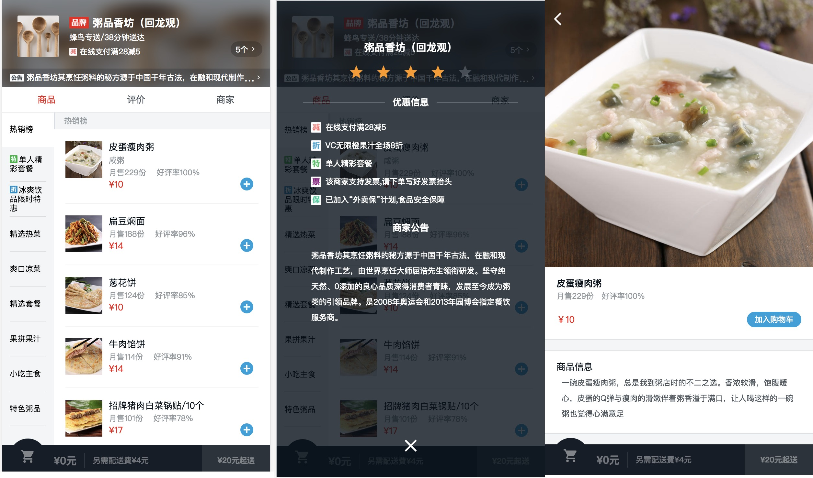
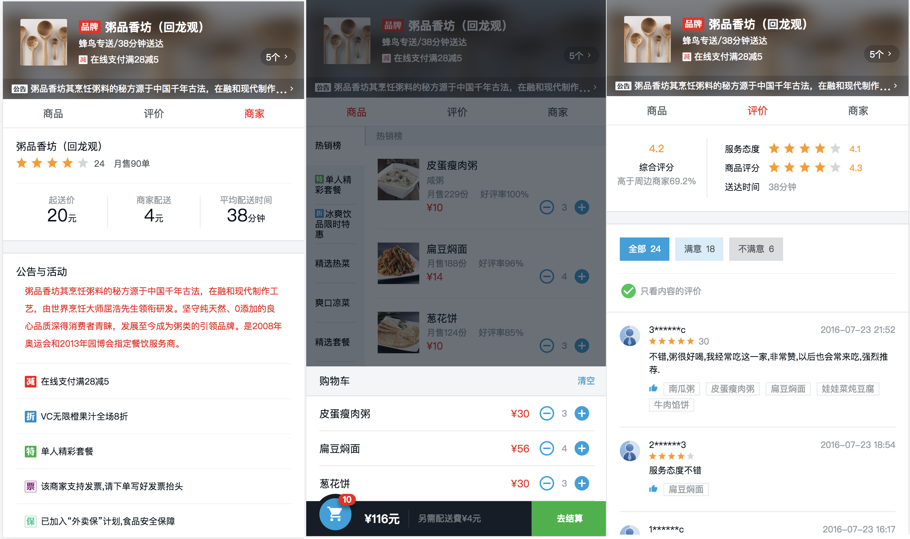

# sell

> vue仿饿了么外卖

[项目演示地址](https://qinjingfei.github.io/sell/)


效果图





## 目录


NO| Guide | NO | Guide |
---| --- | ---|---|
 1 |  [webpack概念](./notes/1_webpack.md) | 2 | [准备工作](./notes/2_preparation.md)  |
 3 | [页面骨架开发](./notes/3_skeleton.md) |4 | [header组件的开发](./notes/4_header.md)| 
 5 |[goods组件](./notes/5_goods.md)  | 6|[vue的一些知识点](./notes/6_computed.md)|
 7| [部署Vue应用到服务器上](./notes/7_nginx.md)

## Build Setup

``` bash
# install dependencies
npm install

# serve with hot reload at localhost:8080
npm run dev

# build for production with minification
npm run build

# build for production and view the bundle analyzer report
npm run build --report
```

For a detailed explanation on how things work, check out the [guide](http://vuejs-templates.github.io/webpack/) and [docs for vue-loader](http://vuejs.github.io/vue-loader).


