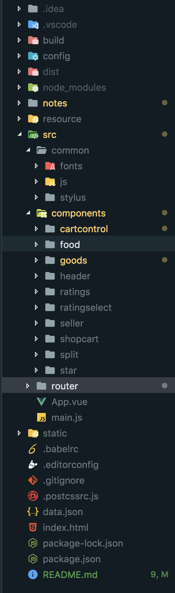

# 页面骨架开发


## 项目目录

项目完成后的目录



* `commom` 放一些通用静态资源(字体文件，公用的图片等)
* `components` 放一些vue组件
* `router` 路由相关文件
* `api` 放一些与后端请求有关的代码(ajax, jsonp等)

由于，我们是用mock的数据. 所以，实际上我们并没有`api`文档. 
一些关于`api`的设置放在`webpack.dev.conf.js`中

## vue 组件

[vue components教程](https://cn.vuejs.org/v2/guide/components-registration.html)
目前将项目分为四个主要组件, `header.vue`, `goods.vue`, `ratings.vue`和`seller.vue`

```
── components
   ├── goods
   │   └── goods.vue
   ├── header
   │   └── header.vue
   ├── ratings
   │   └── ratings.vue
   └── seller
       └── seller.vue

```

`header`组件在`App.vue`中调用，并没有在路由中注册

## 路由

[vue router介绍](https://router.vuejs.org/zh/)

将四个组件添加到路由中

`/sell/src/router/index.js`

```javascript
export default new Router({
  routes: [
    // {
    //   path: '/',
    //   name: 'Header',
    //   component: Header
    // },
    {
    	path: '/goods',
    	name: 'Goods',
    	component: Goods
    },{
      path: '/ratings',
      name: 'Ratings',
      component: Ratings
    },{
      path: '/seller',
      name: 'Seller',
      component: Seller
    }
  ],
  linkActiveClass: 'active'  //自定义active时，添加的class为active
})

```
[linkActiveClass API介绍](https://router.vuejs.org/zh/api/#base)

## 其它

* 移动端的适配
  * `<meta name="viewport" content="width=device-width,initial-scale=1.0,maximum-scale=1.0, minimum-scale=1.0, user-scalable=0"> <!--移动设备适配-->`

* CSS reset

  * `<link rel="stylesheet" href="static/css/reset.css"> <!--import css reset-->`
  * 可以从这里下载[css reset](https://cssreset.com/)

* `devDependencies`中`stylus` 和`stylus-loader`
 
 ```
  npm install stylus stylus-loader --save-dev
 ```

* 添加了一些stylus的代码， 位于 `/sell/src/App.vue`和`/sell/src/stylus/mixin.styl`

## 链接

[css reset](https://cssreset.com/)

[stylus教程](http://stylus-lang.com/)

[vue components教程](https://cn.vuejs.org/v2/guide/components-registration.html)

[linkActiveClass API介绍](https://router.vuejs.org/zh/api/#base)