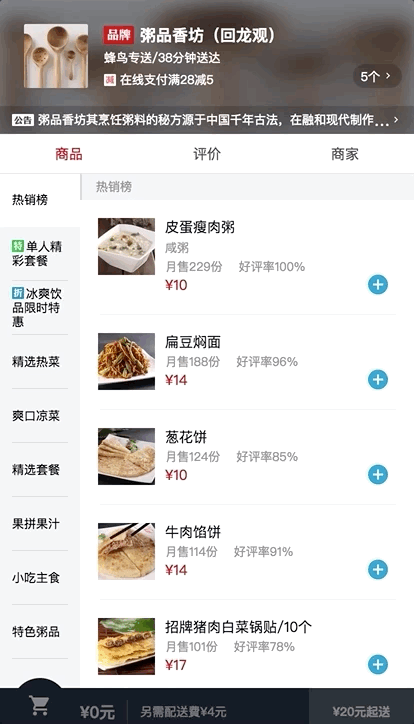

# cartcontrol 组件

主要实现了图标的动画(平移和旋转180度)




在`good`组件中调用 `cartcontrol`组件， 把`food`传给子组件 `cartcontrol`, `add`是一个自定义事件，`shopcart`组件会用到。（这里并没有用到）

```html
<cartcontrol @add="addFood" :food="food"></cartcontrol>

```

接下来看一下，如何在vue中实现这个动画?

```
  <transition name='move'>
          <div class="cart-decrease" v-show='food.count>0' @click.stop.prevent="decreaseCart($event)"> <!--阻止冒泡-->
            <span class="icon-remove_circle_outline inner"></span>
          </div>
  </transition>
  <div class="cart-count" v-show='food.count>0'>{{food.count}}</div>
  <div class="cart-add icon-add_circle" @click.stop.prevent="addCart($event)"></div>  <!--阻止冒泡-->
```
decrease的icon 是根据 food.count 是否大于0 来显示与否， 默认不显示。

```stylus
.cartcontrol
  // 略
  .cart-decrease
    //略
    .inner
     // 略
    &.move-enter-active, &.move-leave-active
      transition: all 0.4s linear
    &.move-enter, &.move-leave-to
      opacity: 0
      transform: translate3d(24px, 0, 0)
      .inner
        transform: rotate(180deg)

```

`move-enter` 、`move-leave-to` 开始的初始位置和离开的末尾位置是 `translate3d(24px, 0, 0)`(与add的icon重合)。


```
addCart(event) {
      //better-scroll派发的event事件和原生js的event有属性上的区别，其中有一个属性为event._constructed。better-scroll派发的事件中event._constructed为true，原生点击事件中没有这个属性。
      if (!event._constructed) {  //如果不存在这个属性,则为原生点击事件，不执行下面的函数
        return;
      }
      if (this.food.count) {
        this.food.count++;
      } else {
        Vue.set(this.food, "count", 1); // 给food添加count属性
      }
      this.$emit('add', event.target); //为了将evet.target传给food.vue,自定义一个事件 add
    },
decreaseCart(event) {
      if (!event._constructed) {
        return;
      }
      if (this.food.count) this.food.count--;
    }
  }

```

`this.$emit('add', event.target);` 自定义add事件，并把`event.target`传出去。这里的`event.target` 是 add icon的DOM

在回顾一下开头的 

```
<cartcontrol @add="addFood" :food="food"></cartcontrol>
```

自定义事件add的`event.target`传给了`addFood`

再看一下good组件中`addFood`方法

```

addFood(target) {
      this.$nextTick(() => {                        //DOM更新完后，执行shopcart的drop方法
        this.$refs.shopcart.drop(target);           //traget是来自于子组件cartcontrol
      });
}
```
`addFood`中调用了子组件`shopcart`的`drop`方法，并把`event.target`传给`drop`方法.(event.target 是add icon 的DOM)

为什么需要把`cartcontrol`组件中的add icon的DOM传给`shopcart`组件？

因为，`shopcart`组件实现小球坠落时，需要用到 add icon的x, y 值.