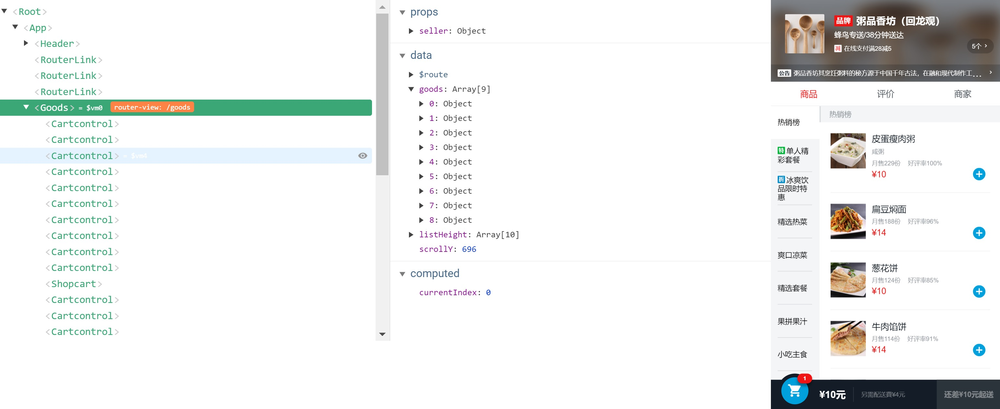

# goods 组件

这是goods组件的部分数据和效果图


## 如何实现右侧下拉并且与左侧菜单栏匹配

### 涉及的vue特性

* `vm.$refs`
  * An object of DOM elements and component instances, registered with ref attributes.
* `vm.$nextTick( [callback] )`
  * Defer the callback to be executed after the next DOM update cycle

[vm.$refs](https://devdocs.io/vue~2/api/index#vm-refs)

[vm.$nextTick( [callback] )](https://devdocs.io/vue~2/api/index#vm-nextTick-callback)

### 细节

*　通过`vue-resource`(ajax)得到 mock的数据

``` javascript
   created() {
    this.$http.get("/api/goods").then(response => {
      //因为是mock的数据，所以一定会成功，就不写失败的call back了
      response = response.body; //extract json from response
      if (response.errno === ERR_OK) {
        this.goods = response.data;
        this.$nextTick(() => {        //会在下一次DOM更新时，执行
          this._initScroll();         //初始化BScroll
          this._calculateHeight();    //计算每个foodlist高度，并把它们的accumulator放入到数组listHeight中
        });
      }
    });
    this.classMap = ["decrease", "discount", "special", "invoice", "guarantee"];
  },
```

* 在DOM渲染完成后，初始化BScroll

```javascript
_initScroll() {
      this.menuScroll = new BScroll(this.$refs.menuWrapper, {   //初始化menuScroll, 但是项目中并没有用到这个，因为meanuWrapper不需要下拉
        click: true          //better-scroll会将点击事件去掉，如果滚动部分需要有点击事件，需要在参数里加上click：true
      });
      this.foodsScroll = new BScroll(this.$refs.foodWrapper, {   //初始化foodScroll
        probeType: 3,      
        click: true         //better-scroll会将点击事件去掉，如果滚动部分需要有点击事件，需要在参数里加上click：true
      });
      this.foodsScroll.on( // 监听scroll事件， 每次发生变化把正整数pos.y 传给this.scrollY
        "scroll",
        pos => (this.scrollY = Math.abs(Math.round(pos.y)))
      );
    }
```

* 在DOM渲染完成后，计算每个foodlist高度

```javascript
//计算foodList每个元素的高度，并把它们放入数组listHeight中
    _calculateHeight() {
      let foodList = this.$refs.foodList;
      let height = 0;
      this.listHeight.push(height);
      for (let i = 0; i < foodList.length; i++) {
        let item = foodList[i];
        height += item.clientHeight;
        this.listHeight.push(height);
      }
    },
```

* 在computed(会缓存) 中的 `currentIndex`， `this.scrollY`跟数组`this.listHeight`中元素作比较，如果处于两个元素之间, return i. 否则return 0

```
currentIndex() {                                     
      for (let i = 0; i < this.listHeight.length; i++) {
        let height1 = this.listHeight[i];
        let height2 = this.listHeight[i + 1];
        // height2 不存在(height2 只有在height1是最后一个元素时才不存在) 
        //或者this.crollY 在 height1和height2 之间的时候 return index i 
        if (!height2 || (this.scrollY >= height1 && this.scrollY < height2)) {
          return i;
        }
      }
      return 0;
    }
```

* 如果，`currentIndex === index`渲染`class: current`. 否则，do nothing.

```html
  <li v-for="(item,index) in goods" class="menu-item" :class="{'current':currentIndex===index}" @click="selectMenu(index,$event)" ref="menuList" :key="index">
```

就此实现右侧下拉并且与左侧菜单栏匹配.

