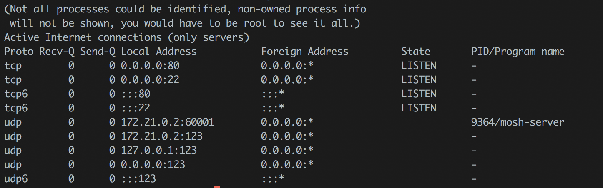
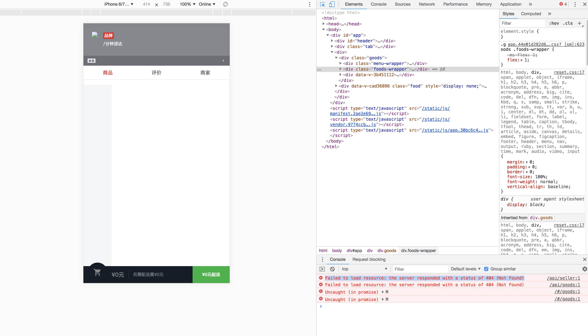
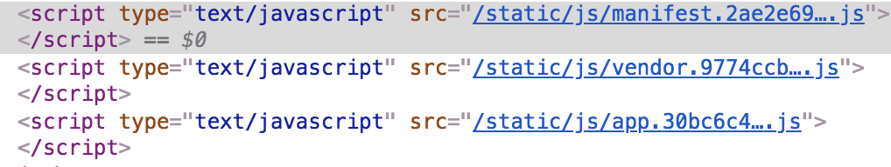
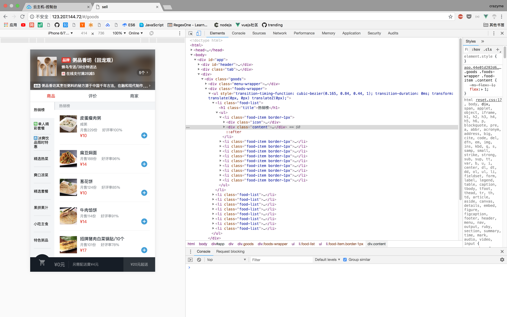

# 部署Vue应用到服务器上


## VPS

* 购买任何VPS
* 把ssh key传入vps的`~/.ssh/authorized_keys`
* 域名解析

因为，以上步骤很简单。所以，略过。

## 安装以及配置nginx

安装nginx

```
sudo apt update; 
sudo apt install nginx -y;

```
允许HTTP Traffic 通过防火墙

```
sudo ufw allow 'Nginx HTTP'
```

配置nginx


```
sudo vim /etc/nginx/sites-available/default

```

修改文件

```
# 加入这一行, vue router 处理 404
error_page 404 /index.html;

# 修改前
# root /var/www/html
root /var/www/html/Vue/dist

# 把下面这一行，改成注释
# try_files $uri $uri/ =404
```

测试nginx配置文件，是否成功

```
sudo nginx -t
```

```
nginx: the configuration file /etc/nginx/nginx.conf syntax is ok
nginx: configuration file /etc/nginx/nginx.conf test is successful
```

重启nginx 服务

```
sudo systemctl restart nginx
```

确认80端口打开

```
netstat -plntu
```




## webpack 打包

运行

```
npm run build
```

复制dist, 到服务器上

```
# 注意用户是root，因为要用到root权限
scp -r  ./dist   root@ipv4:/var/www/html/Vue
```
在浏览器打开服务器ip地址




为什么会有404呢？



可以看到这里`script`中的路径是绝对路径(错误)， 应该用相对路径。
还有就是mock数据没有被打包到项目中


修改`config/index.js`

```
build: {

 assetsPublicPath: './',

}

```

把mock数据放到github上，直接向数据所在url发起http请求

`src/ratings/ratings.vue`

```
created() {
		const url = 'https://raw.githubusercontent.com/qinjingfei/sell/master/data.json'
		this.$http.get(url).then((response) => {
			response = response.body;
			this.ratings = response.ratings;
			
		});
    },
```

还需要更改`src/goods/goods.vue` 和 `src/App.vue` 这里略过

现在，在运行

```
npm run build
```

把生成的dist文件夹复制到服务器`/var/www/Vue/`




就此，成功将vue项目部署到服务器上.


[vue项目](https://zc95.github.io/2018/05/25/vue-sell/index.html)