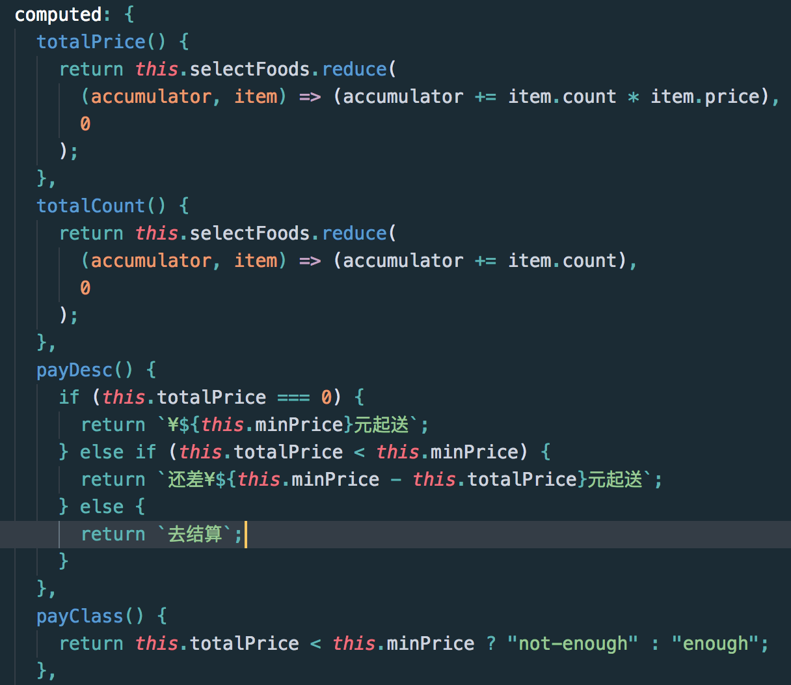

# 计算属性

## 什么时候使用计算属性

对于任何复杂逻辑，都应当使用计算属性。




## 计算属性缓存vs方法

* **计算属性是基于它们的依赖进行缓存的**。计算属性只有在它的相关依赖发生改变时才会重新求值。

这意味着只要`selectFoods`数组没有发生改变，多次访问`totalPrice` 计算属性会立即返回之前的计算结果，而不必再次执行函数。

* 每当触发重新渲染时，调用方法将**总会**再次执行函数

这意味着只要调用`totalPrice`总会执行这个函数


# 事件处理


有时也需要在内联语句处理器中访问原始的 DOM 事件。可以用特殊变量 $event 把它传入方法：

```
  <li v-for="(item,index) in goods" class="menu-item"  :class="{'current':currentIndex===index}"
                @click="selectMenu(index,$event)" ref="menuList" :key="index">

```

```
selectMenu(index, event) {
      if (!event._constructed) {
        return;
      }
      let foodList = this.$refs.foodList;
      let el = foodList[index];
      this.foodsScroll.scrollToElement(el, 300);
    },
```

## 事件修饰符
在事件处理程序中调用 `event.preventDefault()` 或 `event.stopPropagation()` 是非常常见的需求

为了解决这个问题，Vue.js 为 v-on 提供了事件修饰符。之前提过，修饰符是由点开头的指令后缀来表示的。

```
<!-- 阻止单击事件继续传播 -->
<a v-on:click.stop="doThis"></a>

<!-- 提交事件不再重载页面 -->
<form v-on:submit.prevent="onSubmit"></form>

<!-- 修饰符可以串联 -->
<a v-on:click.stop.prevent="doThat"></a>

<!-- 只有修饰符 -->
<form v-on:submit.prevent></form>

<!-- 添加事件监听器时使用事件捕获模式 -->
<!-- 即元素自身触发的事件先在此处处理，然后才交由内部元素进行处理 -->
<div v-on:click.capture="doThis">...</div>

<!-- 只当在 event.target 是当前元素自身时触发处理函数 -->
<!-- 即事件不是从内部元素触发的 -->
<div v-on:click.self="doThat">...</div>
```

[事件处理](https://cn.vuejs.org/v2/guide/events.html)

# `v-if` vs `v-show`

v-if 是“真正”的条件渲染，因为它会确保在切换过程中条件块内的事件监听器和子组件适当地被销毁和重建。
v-if 也是惰性的：如果在初始渲染时条件为假，则什么也不做——直到条件第一次变为真时，才会开始渲染条件块。
相比之下，v-show 就简单得多——不管初始条件是什么，元素总是会被渲染，并且只是简单地基于 CSS 进行切换。

[条件渲染](https://cn.vuejs.org/v2/guide/conditional.html)


# 组件基础

## 组件的复用

```
<div id="components-demo">
  <button-counter></button-counter>
  <button-counter></button-counter>
  <button-counter></button-counter>
</div>
```
每用一次组件，就会有一个它的新实例被创建。

## `data`必须是一个函数
一个组件的 `data` 选项必须是一个函数，因此每个实例可以维护一份被返回对象的独立的拷贝：

```
data: function () {
  return {
    count: 0
  }
}
```

## 通过 Prop 向子组件传递数据

[Prop](https://cn.vuejs.org/v2/guide/components-props.html)

```
  <!--把food传给子组件cartcontrol， add是在food.vue里自定义的事件, 是为了将target传给父组件(goods.vue)-->
 <cartcontrol @add="addFood" :food="food"></cartcontrol>
```

```
 props:{
        food: {
            type: Object
        }
    }
```


## 单个根元素

every component must have a single root element (每个组件必须只有一个根元素)


## 通过事件向父级组件发送消息

我们可以调用内建的 `$emit` 方法并传入事件的名字，来向父级组件触发一个事件：

```
<button v-on:click="$emit('enlarge-text')">
  Enlarge text
</button>
```


```
<blog-post
  ...
  v-on:enlarge-text="postFontSize += 0.1"
></blog-post>
```


[组件基础](https://cn.vuejs.org/v2/guide/components.html)


## 处理边界情况

[处理边界情况](https://cn.vuejs.org/v2/guide/components-edge-cases.html)

### 访问子组件实例或子元素

尽管存在 prop 和事件，有的时候你仍可能需要在 JavaScript 里直接访问一个子组件。为了达到这个目的，你可以通过 `ref` 特性为这个子组件赋予一个 ID 引用。例如：

```
<base-input ref="usernameInput"></base-input>

```
可以使用:
```
this.$refs.usernameInput
```
来访问这个 `<base-input>` 实例

例子：

```
 <!--把food传给子组件cartcontrol， add是在food.vue里自定义的事件, 是为了将target传给父组件(goods.vue)-->
<cartcontrol @add="addFood" :food="food"></cartcontrol>
```

```
//DOM更新完后，执行shopcart的drop方法
addFood(target){
  this.$nextTick(() => {
    this.$refs.shopcart.drop(target); 
  });
}

```


# Truthy

在JS中， Truthy(真值)指的是在Boolean上下文中转换后的值为真的值. 除非它们被定义为 falsy (即， 除了`false`，`0`，`“”`，`null`，`undefined`和`NaN` 外)。

JS在Boolean上下文中使用强制类型转换.(JS中`==`也会使用强制类型转换)

JavaScript中的真值示例如下（将被转换为true类型，if 后的代码段将被执行):

```
if (true)
if ({})
if ([])
if (42)
if ("foo")
if (new Date())
if (-42)
if (3.14)
if (-3.14)
if (Infinity)
if (-Infinity)

```

