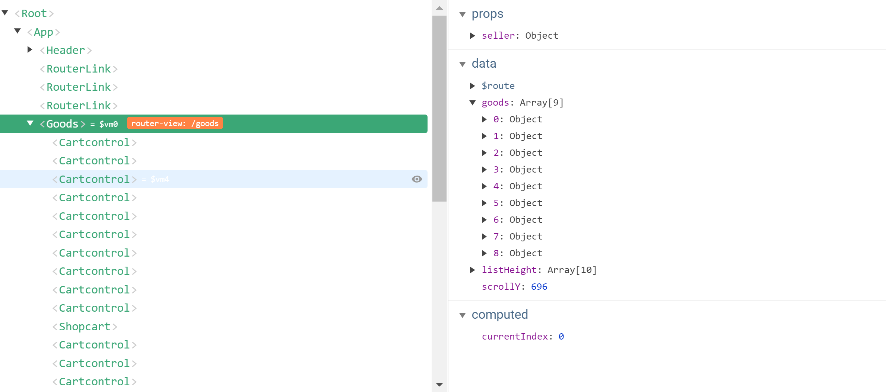
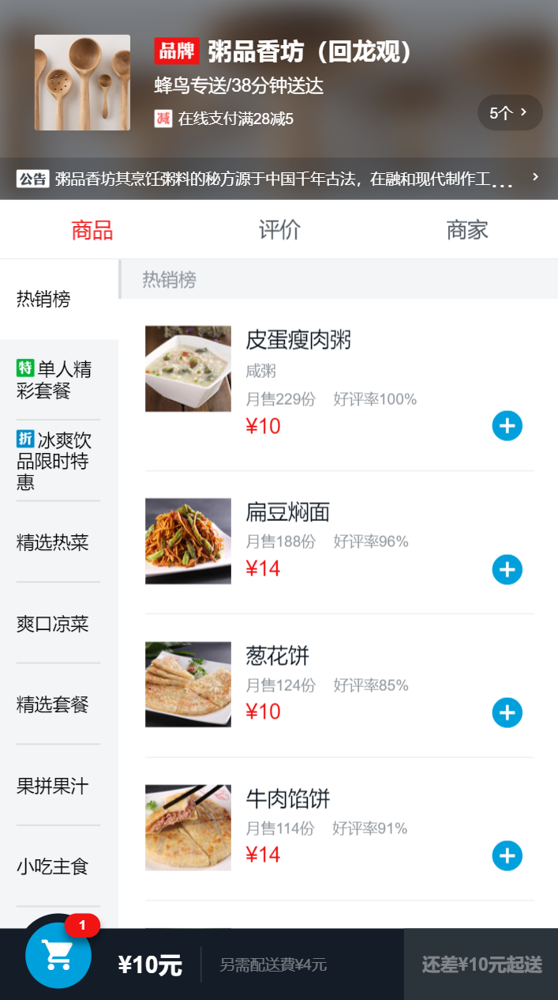

# goods 组件

这是goods组件的部分结构和数据

这里是goods组件的部分效果图


## 如何实现右侧下拉并且与左侧菜单栏匹配

### 涉及的vue特性

* `vm.$refs`
  * An object of DOM elements and component instances, registered with ref attributes.
* `vm.$nextTick( [callback] )`
  * Defer the callback to be executed after the next DOM update cycle

[vm.$refs](https://devdocs.io/vue~2/api/index#vm-refs)

[vm.$nextTick( [callback] )](https://devdocs.io/vue~2/api/index#vm-nextTick-callback)

### 细节

*　通过`vue-resource`(ajax)得到 mock的数据

``` javascript
   created() {
    this.$http.get("/api/goods").then(response => {
      //因为是mock的数据，所以一定会成功，就不写失败的call back了
      response = response.body; //extract json from response
      if (response.errno === ERR_OK) {
        this.goods = response.data;
        this.$nextTick(() => {        //会在下一次DOM更新时，执行
          this._initScroll();         //初始化BScroll
          this._calculateHeight();    //计算每个foodlist高度，并把它们的accumulator放入到数组listHeight中
        });
      }
    });
    this.classMap = ["decrease", "discount", "special", "invoice", "guarantee"];
  },
```

* 在DOM更新时，初始化BScroll

```javascript
 _initScroll() {
      this.menuScroll = new BScroll(this.$refs.menuWrapper, {
        click: true
      });
      this.foodsScroll = new BScroll(this.$refs.foodWrapper, {
        probeType: 3,
        click: true
      });
      this.foodsScroll.on("scroll", pos => {
        this.scrollY = Math.abs(Math.round(pos.y));
      });
```

在初始化`BScroll`时，第一个参数需要传入DOM对象, 那如何在vue中取得DOM对象呢?

`vue.$refs`

```javascript
document.querySelector('.food-list') === $vm0.$refs.foodList[0]
//true
```