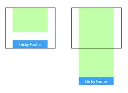

# header组件

## Vue 部分

### vue resource

>The plugin for Vue.js provides services for making web requests and handle responses using a XMLHttpRequest or JSONP.

[vue resource github](https://github.com/pagekit/vue-resource)

* 首先，我们需要取得mock data.

`src/App.vue`

```javascript
 import Header from './components/header/header.vue'

  const ERR_OK = 0;
  export default {
    name: 'App',
    data() {
      return {
        seller: {}
      };
    },
    created() {
      //因为是mock的数据，所以一定会成功，就不写失败的call back了
      // 这里是一个promise对象
      this.$http.get('/api/seller').then((response) => {
        //extract json from response
        // reponse.json 是一个promise对象,所以这里我们用response.body
        response = response.body;
        this.seller = response.data
        }
      })
    },
    components: {
      Header           //es6 相当于 Header: Header
    }
  }

```

* 然后，我们需要把在`src/App.vue`中取得的`seller`传给子组件`header.vue`.

[props介绍](https://cn.vuejs.org/v2/guide/components-props.html)

`src/App.vue`

```
<!-- 把seller 传给子组件 header.vue -->
<!-- 这是一个 JavaScript 表达式而不是一个字符串。-->
<Header :seller="seller"></Header>

```

`src/components/header/header.vue`

```
 //...
props: {
  seller: {
    type: Object
  }
}

//...
```

* vue根据不同type切换不同图片

```
<ul v-if="seller.supports" class="supports">
  <li class="support-item" v-for="(item,index) in seller.supports">
    <span class="icon" :class="classMap[seller.supports[index].type]"></span>
    <span class="text">{{seller.supports[index].description}}</span>
  </li>
</ul>

//....

created() {
      this.classMap = ["decrease", "discount", "special", "invoice", "guarantee"];
}

//...


&.decrease
  bg-image('decrease_1')
&.guarantee
  bg-image('guarantee_1')
&.discount
  bg-image('discount_1')
&.invoice
  bg-image('invoice_1')
&.special
  bg-image('special_1')

```

## CSS 部分

### css sticky footer

 >Sticky footers可以概括如下: 如果页面内容不够长的时候，页脚块粘贴在视窗底部；如果内容足够长时，页脚块会被内容向下推送.



[各种CSS实现Sticky Footer](https://mp.weixin.qq.com/s?__biz=MzU0OTE3MjE1Mw%3D%3D&mid=2247483693&idx=1&sn=ea846c8a1b404a8a0aa5a5175059e0f4&chksm=fbb2a7fbccc52eed1b62f21503d93449c8425c464d5b4ac576facadf560f95ab9ea8aca5484b&mpshare=1&scene=23&srcid=1120MlKsKxWYxEsbttZ5V0CO)

在这个项目中，我们是用第二种将页脚的顶部外边距设为负数的方式实现的。

给内容外增加父元素，并让内容部分的底部内边距与页脚高度的值相等。

```html
<div class="detail-wrapper clearfix">
    <div class="detail-main">
     </div>
</div>

<div class="detail-close" @click="hideDetail">
    <i class="icon-close"></i>
</div>
```

```CSS
.detail-wrapper
    width: 100%
    min-height: 100%           //需要
    .detail-main
      margin-top: 64px
      padding-bottom: 64px    //给.detail-close留出空间


.detail-close
    position: relative
    width: 32px
    height: 32px
    margin: -64px auto 0 auto   //负margin
    clear: both
    font-size: 32px
```

### devicePixelRatio

[devicePixelRatio](https://www.cnblogs.com/moqiutao/p/6818235.html)

>devicePixelRatio ，它是设备上物理像素和设备独立像素( device-independent pixels (dips) )的比例，即 devicePixelRatio = 屏幕物理像素/设备独立像素 

* 区分普通显示屏和高清屏

当devicePixelRatio值等于1时（也就是最小值），那么它普通显示屏，当devicePixelRatio值大于1(通常是1.5、2.0)，那么它就是高清显示屏。


在这个项目中，不同的devicePixelRatio现实不同的图片

```
bg-image($url)
  background-image: url($url + "@2x.png")
  @media (-webkit-min-device-pixel-ratio: 3), (min-device-pixel-ratio: 3)
    background-image: url($url + "@3x.png")


@media (-webkit-min-device-pixel-ratio: 1.5),(min-device-pixel-ratio: 1.5)
  .border-1px
    &::after
      -webkit-transform: scaleY(0.7)
      transform: scaleY(0.7)

@media (-webkit-min-device-pixel-ratio: 2),(min-device-pixel-ratio: 2)
  .border-1px
    &::after
      -webkit-transform: scaleY(0.5)
      transform: scaleY(0.5)

```

### `inline-block`元素间间隙

>inline-block 即内联块，可以水平排版

[inline-block元素间间隙产生及去除详解](http://demo.doyoe.com/css/inline-block-space/)

* 间隙的由来(换行)

```html

<div id="demo">
  <span>我是一个span</span>
  <span>我是一个span</span>
  <span>我是一个span</span>
  <span>我是一个span</span>
</div>

```

在本例中，我们不对span做任何处理，你会发现span元素间也存在间隙，你有否怀疑这是由于换行导致？OK，我们来验证下这个疑问；

```html

<div id="demo">
  <span>我是一个span</span><span>我是一个span</span><span>我是一个span</span><span>我是一个span</span>
</div>

```

在本例中，我们只是将上例中**`span`写到同一行**，间隙没有了；所以说间隙是由换行或者回车导致的，应该无大问题

* 干掉间隙方案2: font-size:0 

```html
<div id="demo">
  <span>我是一个span</span>
  <span>我是一个span</span>
  <span>我是一个span</span>
  <span>我是一个span</span>
  <span>我是一个span</span>
</div>
```

```CSS
#demo{
  font-size:0;
}
#demo span{
  display:inline-block;
  display:inline;
  zoom:1;
  font-size:14px;
}

```

奇怪？为什么font-size会对间隙有影响。因为space是由换行或回车所产生空白符所致，既然是字符当然无法摆脱font的控制