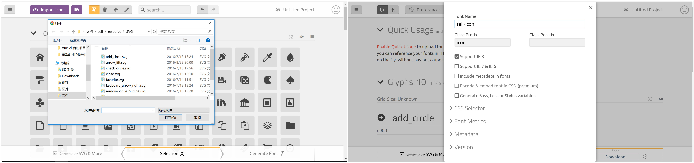

# 准备工作

## 项目资源准备

下载resource 文件，并把reource 添加到 `/sell`目录下 


## 图标字体制作

> IcoMoon is an icon solution, providing three main services: Vector Icon Packs, The IcoMoon App, and hosting icons as SVGs or fonts. Read further to learn about each service in detail.

[iconmoon](https://icomoon.io/)

我们用iconmoon把一些svg 文件转化为字体文件

* 上传 `/sell/resource/SVG` 中所有svg文件iconmmon
* Generate Font
* 点击Preference，修改Font-Name为`sell-icon`
* Download fonts 




## 项目目录设计

在`/sell/src`中创建共有文件夹`common`, common 中包括`fonts`,`js`和`stylus` 文件夹

* 把刚才从iconmoon 下载的`fonts`文件夹里的文件，放入`/sell/src/common/fonts`中
* 把`sytle.css` 改名为`icon.css`, 并放入 `/sell/src/common/stylus`中

## mock数据(模拟后台数据)

`/sell/build/webpack.dev.conf.js`


```
//定义一些api 
const appData = require('../data.json') 
const seller = appData.seller 
const goods = appData.goods 
const ratings = appData.ratings 


devServer: { 
//...

	
	before(app) { 
      app.get('/api/seller', function(req, res) { 
        res.json({ 
          errno: 0, 
          data: seller 
        }) 
      }); 
      app.get('/api/goods', function(req, res) { 
        res.json({ 
          errno: 0, 
          data: goods 
        }) 
      }); 
      app.get('/api/ratings', function(req, res) { 
        res.json({ 
          errno: 0, 
          data: ratings 
        }) 
      }); 
    },

//.....

} 


```

