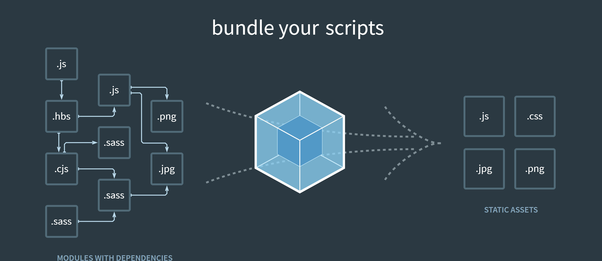

# webpack



[webpack官方文档](https://www.webpackjs.com/concepts/)
## 概念

>本质上，webpack 是一个现代 JavaScript 应用程序的静态模块打包器(module bundler)。当 webpack 处理应用程序时，它会递归地构建一个依赖关系图(dependency graph)，其中包含应用程序需要的每个模块，然后将所有这些模块打包成一个或多个 bundle

webpack的四个核心概念:
* entry  -- 入口
* output -- 输出
* loader
* plugins --插件


## Entry(入口)

 >入口起点(entry point)指示 webpack 应该使用哪个模块，来作为构建其内部依赖图的开始。进入入口起点后，webpack 会找出有哪些模块和库是入口起点（直接和间接）依赖的。
 可以通过在 webpack 配置中配置 entry 属性，来指定一个入口起点（或多个入口起点）。默认值为 ./src。

 在这个项目中`entry`配置:


 `/sell/build/webpack.base.conf.js`

```
module.exports = {
  //... 
  
  entry: {
    app: './src/main.js'
  }

 //...
}
 
```


## Output(出口)

 > output 属性告诉 webpack 在哪里输出它所创建的 bundles，以及如何命名这些文件，默认值为 ./dist。基本上，整个应用程序结构，都会被编译到你指定的输出路径的文件夹中。你可以通过在配置中指定一个 output 字段，来配置这些处理过程：

`/sell/build/webpack.base.conf.js`

```
module.exports = {
 //...

  entry: {
    app: './src/main.js'
  },
  output: {
    path: config.build.assetsRoot,
    filename: '[name].js',
    publicPath: process.env.NODE_ENV === 'production'
      ? config.build.assetsPublicPath
      : config.dev.assetsPublicPath
  }

  //...

}

```

`/sell/config/index.js`

```
dev:{
	
	//...
	
	assetsSubDirectory: 'static',
    assetsPublicPath: '/',
    
    //...
},

build:{
	
	//...
	
	assetsRoot: path.resolve(__dirname, '../dist'),
    assetsSubDirectory: 'static',
    assetsPublicPath: '/',

	//...
}

```

可以看到 通过`output.path` 和 `output.name`属性，来告诉 webpack bundle 的名称，以及我们想要 bundle 生成(emit)到哪里.

在这个项目中, bundle会生成在 `/sell/dist`中, 名字叫`[name].js`(app.js).

## loader

> loader 让 webpack 能够去处理那些非 JavaScript 文件（webpack 自身只理解 JavaScript）。loader 可以将所有类型的文件转换为 webpack 能够处理的有效模块，然后你就可以利用 webpack 的打包能力，对它们进行处理。本质上，webpack loader 将所有类型的文件，转换为应用程序的依赖图（和最终的 bundle）可以直接引用的模块.

在更高层面，在 webpack 的配置中 loader 有两个目标：

* test 属性，用于标识出应该被对应的 loader 进行转换的某个或某些文件。
* use 属性，表示进行转换时，应该使用哪个 loader。

`/sell/build/webpack.base.conf.js`

```
module.exports = {
	
	//...
	
	module: {
    rules: [
      {
        test: /\.vue$/,          //.vue结尾的文件
        loader: 'vue-loader',
        options: vueLoaderConfig
      },
      {
        test: /\.js$/, 			//.js结尾的文件
        loader: 'babel-loader',
        include: [resolve('src'), resolve('test'), resolve('node_modules/webpack-dev-server/client')]
      },
      {
        test: /\.(png|jpe?g|gif|svg)(\?.*)?$/,	//图片
        loader: 'url-loader',
        options: {
          limit: 10000,		//当图片大小小于10kb时，生成字符串，打包到编译的js文件里
                       		// 当图片大于10kb, 单独生成一个文件
          name: utils.assetsPath('img/[name].[hash:7].[ext]')
        }
      },
      {
        test: /\.(mp4|webm|ogg|mp3|wav|flac|aac)(\?.*)?$/,		//媒体文件
        loader: 'url-loader',
        options: {
          limit: 10000,
          name: utils.assetsPath('media/[name].[hash:7].[ext]')
        }
      },
      {
        test: /\.(woff2?|eot|ttf|otf)(\?.*)?$/, 				//字体文件
        loader: 'url-loader',
        options: {
          limit: 10000,
          name: utils.assetsPath('fonts/[name].[hash:7].[ext]')
        }
      }
    ]
  },
	
	//...
}

```
本项目loader配置中没有使用`use`

下面是一个使用`use`的例子

```
const path = require('path');

const config = {
  output: {
    filename: 'my-first-webpack.bundle.js'
  },
  module: {
    rules: [
      { test: /\.txt$/, use: 'raw-loader' } // .txt结尾的文件，用`raw-laoder`进行转换
    ]
  }
};

module.exports = config;

```

以上配置中，对一个单独的 module 对象定义了 rules 属性，里面包含两个必须属性：`test` 和 `use`.

> “嘿，webpack 编译器，当你碰到「在 require()/import 语句中被解析为 '.txt' 的路径」时，在你对它打包之前，先使用 raw-loader 转换一下。”

## Plugins(插件)
 
>loader 被用于转换某些类型的模块，而插件则可以用于执行范围更广的任务。插件的范围包括，从打包优化和压缩，一直到重新定义环境中的变量。插件接口功能极其强大，可以用来处理各种各样的任务。
想要使用一个插件，你只需要 require() 它，然后把它添加到 plugins 数组中。多数插件可以通过选项(option)自定义。你也可以在一个配置文件中因为不同目的而多次使用同一个插件，这时需要通过使用 new 操作符来创建它的一个实例

`/sell/build/webpack.dev.conf.js`


```
const HtmlWebpackPlugin = require('html-webpack-plugin') 
const webpack = require('webpack'); // 用于访问内置插件

devServer:{

	//...

	
	plugins: [
    new webpack.DefinePlugin({
      'process.env': require('../config/dev.env')
    }),
    new webpack.HotModuleReplacementPlugin(),
    new webpack.NamedModulesPlugin(), // HMR shows correct file names in console on update.
    new webpack.NoEmitOnErrorsPlugin(),
    // https://github.com/ampedandwired/html-webpack-plugin
    new HtmlWebpackPlugin({
      filename: 'index.html',
      template: 'index.html',
      inject: true
    }),
    // copy custom static assets
    new CopyWebpackPlugin([
      {
        from: path.resolve(__dirname, '../static'),
        to: config.dev.assetsSubDirectory,
        ignore: ['.*']
      }
    ])
  ]


  //...
}

```